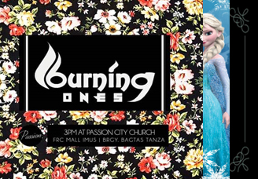
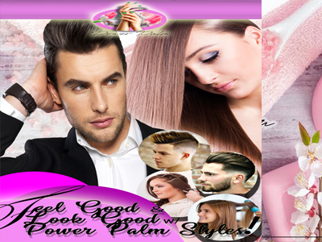

<!DOCTYPE html>
<html lang="en">
<head>
  <meta charset="utf-8">
  <title>JOHN BENEDICT TAYO</title>
  <meta content="width=device-width, initial-scale=1.0" name="viewport">
  <meta content="" name="keywords">
  <meta content="" name="description">

  <!-- Favicons -->
  <link href="img/favicon.png" rel="icon">
  <link href="img/apple-touch-icon.png" rel="apple-touch-icon">

  <!-- Google Fonts -->
  <link href="https://fonts.googleapis.com/css?family=Open+Sans:300,300i,400,400i,700,700i|Poppins:300,400,500,700" rel="stylesheet">

  <!-- Bootstrap CSS File -->
  <link href="lib/bootstrap/css/bootstrap.min.css" rel="stylesheet">

  <!-- Libraries CSS Files -->
  <link href="lib/font-awesome/css/font-awesome.min.css" rel="stylesheet">
  <link href="lib/animate/animate.min.css" rel="stylesheet">

  <!-- Main Stylesheet File -->
  <link href="css/style.css" rel="stylesheet">

  <!-- =======================================================
    Theme Name: Regna
    Theme URL: https://bootstrapmade.com/regna-bootstrap-onepage-template/
    Author: BootstrapMade.com
    License: https://bootstrapmade.com/license/
  ======================================================= -->
</head>

<body>

  <!--==========================
  Header
  ============================-->
  <header id="header">
    

      

        <a href="#hero"></img></a>
        <!-- Uncomment below if you prefer to use a text logo -->
        <!--<h1><a href="#hero">Regna</a></h1>-->
      

      <nav id="nav-menu-container">
        <ul class="nav-menu">
          <li class="menu-active"><a href="#hero">Home</a></li>
          <li><a href="#about">About Me</a></li>
          <li><a href="#services">Services</a></li>
          <li><a href="#portfolio">Portfolio</a></li>
          <li><a href="#team">Team</a></li>
         <!-- <li class="menu-has-children"><a href="">Drop Down</a>
            <ul>
              <li><a href="#">Drop Down 1</a></li>
              <li class="menu-has-children"><a href="#">Drop Down 2</a>
                <ul>
                  <li><a href="#">Deep Drop Down 1</a></li>
                  <li><a href="#">Deep Drop Down 2</a></li>
                  <li><a href="#">Deep Drop Down 3</a></li>
                  <li><a href="#">Deep Drop Down 4</a></li>
                  <li><a href="#">Deep Drop Down 5</a></li>
                </ul>
              </li>
              <li><a href="#">Drop Down 3</a></li>
              <li><a href="#">Drop Down 4</a></li>
              <li><a href="#">Drop Down 5</a></li>
            </ul>
          </li>-->
          <li><a href="#contact">Contact Me</a></li>
        </ul>
      </nav><!-- #nav-menu-container -->
    

  </header><!-- #header -->

  <!--==========================
    Hero Section
  ============================-->
  <section id="hero">
    
 
      <h1>JOHN BENEDICT TAYO  </h1>
      <h2>FREELANCER | VIDEO EDITOR | GRAPHIC DESIGNER | PHOTOGRAPHER | CARTOONIST</h2>
      <a href="#about" class="btn-get-started">Tour</a>
    

  </section><!-- #hero -->

  <main id="main">

    <!--==========================
      About Us Section
    ============================-->
    <section id="about">
      

        

          

            <h2 class="title">Few Words About JBT</h2>
            

             As a freelancer artist, i have been working with different kinds of people,
             learning in any ways and any of it's kind. My satisfaction comes from the satisfaction
             of my clients. Considering it as a bonus when they tell me that i have exceeded their expectations.
            

            

              
<i class="fa fa-shopping-bag"></i>

              <h4 class="title"><a href="">WORKING EXPERIENCE</a></h4>
              
4 years ago My OJT days experience has let me discover my skills. i've began doing photo edittings, banner layouts, and Visual arts. with my 2 years of job experience it is well applied

            

            

              
<i class="fa fa-photo"></i>

              <h4 class="title"><a href="">SKILLS</a></h4>
              
Video editting is one of my skills, doing AVP Audio Visual Presentation for announements and skit. i can say that i love how it is being done. and i am now exploring and rendering cartoon animation and (3 dimentional) 3D animation 

             
            

            

              
<i class="fa fa-bar-chart"></i>

              <h4 class="title"><a href="">ATTAINMENT</a></h4>
              
Graduate of Computer Network Technology And Currently enrolled as Bachelor of Science in Information Technology as second course.

            

          

          

        

      

    </section><!-- #about -->

    <!--==========================
      Facts Section
    ============================-->
    <section id="facts">
      

        

          <h3 class="section-title">Facts</h3>
          
In years of working in different fields it always lead back to my passion here's my Estmation

        

        

  				

            54
            
Clients

  				

          

            186
            
Projects

  				

          

            24,7
            
Hours Of Support

  				

          

            100
            
Rate Starts at: ($) 

  				

  			

      

    </section><!-- #facts -->

    <!--==========================
      Services Section
    ============================-->
    <section id="services">
      

        

          <h3 class="section-title">Services</h3>
          
need a hand? Let me Help you with something.

        

        

          

            

              
<a href=""><i class="fa fa-desktop"></i></a>

              <h4 class="title"><a href="">VIDEO EDITTINGS</a></h4>
              
Video editing is the process of manipulating and rearranging video shots to create a new work. Editing is usually considered to be one part of the post production process — other post-production tasks include titling, colour correction, sound mixing, etc.
              I used Sony Vegas Pro. 

            

          

         
          

            

              
<a href=""><i class="fa fa-paper-plane"></i></a>

              <h4 class="title"><a href="">SIMPLE ANIMATIONS</a></h4>
              
Animation is a way of making a movie from many still images. The images are put together one after another, and then played at a fast speed to give the illusion of movement. ... A person who makes animations is called an animator. for this i'm using Adobe flash, vegas pro. and adobe photoshop.

            

          

          

            

              
<a href=""><i class="fa fa-photo"></i></a>

              <h4 class="title"><a href="">GRAPHIC DESIGNS</a></h4>
              
Graphic designers create visual concepts, using computer software or by hand, to communicate ideas that inspire, inform, and captivate consumers. They develop the overall layout and production design for various applications such as advertisements, brochures, magazines, and corporate reports. 

            

          

          
         
        

      

    </section><!-- #services -->

    <!--==========================
    Call To Action Section
    ============================-->
    <section id="call-to-action">
      

        

          

            <h3 class="cta-title">Call To Action</h3>
            
 Subscribe.
This CTA doesn't commit a person to a purchase. Rather, it invites them to receive updates from the company. "Subscribe" CTAs are common to company blogs, for which the business wants to develop a readership.

          

          

            <a class="cta-btn align-middle" href="#">Call To Action</a>
          

        

      

    </section><!-- #call-to-action -->

    <!--==========================
      Portfolio Section
    ============================-->
    <section id="portfolio">
      

        

          <h3 class="section-title">Portfolio</h3>
          
Here are some of the work i have displayed Take a look!

        

        

          

            <ul id="portfolio-flters">
              <li data-filter=".filter-app, .filter-card, .filter-logo, .filter-web" class="filter-active">All</li>
              <li data-filter=".filter-app">Banner</li>
              <li data-filter=".filter-card">Invitations</li>
              <li data-filter=".filter-logo">Logo</li>
              <li data-filter=".filter-web">Video</li>
            </ul>
          

        

        

          

            <a href="">
              
              

                <h4>App 1</h4>
                Alored dono par
              

            </a>
          

          

            <a href="">
              
              

                <h4>Ternate Beach Resort</h4>
                Summer Promotion
              

            </a>
          

          

            <a href="">
              
              

                <h4>App 3</h4>
                Alored dono par
              

            </a>
          

          

            <a href="">
              
              

                <h4>Card 1</h4>
                Alored dono par
              

            </a>
          

          

            <a href="">
              
              

                <h4>Card 1</h4>
                Alored dono par
              

            </a>
          

          

            <a href="">
              
              

                <h4>Card 1</h4>
                Alored dono par
              

            </a>
          

          

            <a href="">
              
              

                <h4>Card 2</h4>
                Alored dono par
              

            </a>
          

          

            <a href="">
              
              

                <h4>The Lifeclass Stories</h4>
                Life Mentoring
              

            </a>
          

          

            <a href="">
              
              

                <h4>Card 3</h4>
                Alored dono par
              

            </a>
          

          

            <a href="">
              
              

                <h4>App 2</h4>
                Alored dono par
              

            </a>
          

           

            <a href="">
              
              

                <h4>App 2</h4>
                Alored dono par
              

            </a>
          

           

            <a href="">
              
              

                <h4>App 2</h4>
                Alored dono par
              

            </a>
          

  

            <a href="">
              
              

                <h4>App 2</h4>
                Alored dono par
              

            </a>
          

           

            <a href="">
              
              

                <h4>App 2</h4>
                Alored dono par
              

            </a>
          

            <a href="">
              
              

                <h4>Campus Wide Gathering</h4>
                Event for youth inside the campus
              

            </a>
          

          

            <a href="">
              
              

                <h4>Retro Party</h4>
                MillennialOldschool
              

            </a>
          

          

            <a href="">
              
              

                <h4>CHURCH EVENT HIGHLIGHTS</h4>
                REVIVAL SERIES
              

            </a>
          

          

            <a href="">
              
              

                <h4>DUBBING</h4>
                AVP INVITATION
              

            </a>
          

          

            <a href="">
              
              

                <h4>DEBUTANTE's AVP</h4>
                Exclusively
              

            </a>
          

          

            <a href="">
              
              

                <h4>BurningOnes Introduction</h4>
                a Suspense Comeback 
              

            </a>
          

          

            <a href="">
              
              

                <h4>SAME-DAY EDITTING</h4>
                PISTANGKRISTYANO2019
              

            </a>
          

          

            <a href="">
              
              

                <h4>YOUTH BIG EVENT</h4>
                TESTIMONIALS
              

            </a>
          

         
          

            <a href="">
              
              

                <h4>Legit SkinCare</h4>
                Skin Care Centre
              

            </a>
          

          

            <a href="">
              
              

                <h4>LASHESS SALON</h4>
                one of the Biggest salon in Cavite
              

            </a>
          

 

            <a href="">
              
              

                <h4>PASSIONYOUTH</h4>
                Is a Church Segment for all the youths
              

            </a>
          

          

            <a href="">
              
              

                <h4>Power Palm Massage spa</h4>
                a Newly stablished Leading Spa
              

            </a>
          

           

            <a href="">
               
              

                <h4>INKtegrity</h4>
                a FreeLAnce Comp.
              

            </a>
          

        

      

    </section><!-- #portfolio -->

    <!--==========================
      Team Section
    ============================-->
    <section id="team">
      

        

          <h3 class="section-title">Team</h3>
          
Whenever i needed a team i have people that i can always count on

        

        

          

            

              

              <h4>SEAN MICHAEL CREDO</h4>
              Electronics and Communication Engineer
              

                <a href="www.twitter.com/seanmichaelcredo"><i class="fa fa-twitter"></i></a>
                <a href="www.facebook.com/seanmichaelcredo"><i class="fa fa-facebook"></i></a>
                <a href="www.google-plus.com/seanmichaelcredo"><i class="fa fa-google-plus"></i></a>
                <a href=""><i class="fa fa-linkedin"></i></a>
              

            

          

          

            

              

              <h4>MAICAH BUTCON</h4>
              Recreational Management
              

                <a href="www.twitter.com/maicahbutcon"><i class="fa fa-twitter"></i></a>
                <a href="www.facebook.com/maicahbutcon"><i class="fa fa-facebook"></i></a>
                <a href="www.google-plus.com/maicahbutcon"><i class="fa fa-google-plus"></i></a>
                <a href=""><i class="fa fa-linkedin"></i></a>
              

            

          

          

            

              

              <h4>JOMARI MIRANDA</h4>
              Computer Science
              

                <a href="www.twitter.com/jomarimiranda"><i class="fa fa-twitter"></i></a>
                <a href="www.facebook.com/jomarimiranda"><i class="fa fa-facebook"></i></a>
                <a href="www.google-plus.com/jomarimiranda"><i class="fa fa-google-plus"></i></a>
                <a href=""><i class="fa fa-linkedin"></i></a>
              

            

          

          

            

              

              <h4>MARYJOY GALICIA</h4>
              AB Journalist
              

                <a href="www.twitter.com/maryjoygalicia"><i class="fa fa-twitter"></i></a>
                <a href="www.facebook.com/maryjoygalicia"><i class="fa fa-facebook"></i></a>
                <a href="www.google-plus.com/maryjoygalicia"><i class="fa fa-google-plus"></i></a>
                <a href=""><i class="fa fa-linkedin"></i></a>
              

            

          

        

      

    </section><!-- #team -->

    <!--==========================
      Contact Section
    ============================-->
    <section id="contact">
      

        

          <h3 class="section-title">Contact</h3>
          
Let me hear something from you!

          	 <h3 class="section-title"><a href="#about" class="btn-get-started">Jaybeetayo25@Gmail.com</a> </h3>
          
        

      

      <!-- Uncomment below if you wan to use dynamic maps -->
      <iframe src="https://www.google.com/maps/embed?pb=!1m18!1m12!1m3!1d22864.11283411948!2d-73.96468908098944!3d40.630720240038435!2m3!1f0!2f0!3f0!3m2!1i1024!2i768!4f13.1!3m3!1m2!1s0x89c24fa5d33f083b%3A0xc80b8f06e177fe62!2sNew+York%2C+NY%2C+USA!5e0!3m2!1sen!2sbg!4v1540447494452" width="100%" height="380" frameborder="0" style="border:0" allowfullscreen></iframe>

      

        

          

            

              

                <i class="fa fa-map-marker"></i>
                
Carissa Homes 2 4108 Tanza Cavite, Philippines

              

              

                <i class="fa fa-envelope"></i>
                
jaybeetayo25@gmail.com

              

              

                <i class="fa fa-phone"></i>
                
+63 919 358 4218

              

            

            

              <a href="#" class="twitter"><i class="fa fa-twitter"></i></a>
              <a href="#" class="facebook.com"><i class="fa fa-facebook"></i></a>
              <a href="#" class="instagram"><i class="fa fa-instagram"></i></a>
              <a href="#" class="google-plus"><i class="fa fa-google-plus"></i></a>
              <a href="#" class="linkedin"><i class="fa fa-linkedin"></i></a>
            

          

          

            

              
Your message has been sent. Thank you!

              

              <form action="" method="post" role="form" class="contactForm">
                

                  <input type="text" name="name" class="form-control" id="name" placeholder="Your Name" data-rule="minlen:4" data-msg="Please enter at least 4 chars" />
                  

                

                

                  <input type="email" class="form-control" name="email" id="email" placeholder="Your Email" data-rule="email" data-msg="Please enter a valid email" />
                  

                

                

                  <input type="text" class="form-control" name="subject" id="subject" placeholder="Subject" data-rule="minlen:4" data-msg="Please enter at least 8 chars of subject" />
                  

                

                

                  <textarea class="form-control" name="message" rows="5" data-rule="required" data-msg="Please write something for us" placeholder="Message"></textarea>
                  

                

                
<button type="submit">Send Message</button>

              </form>
            

          

        

      

    </section><!-- #contact -->

  </main>

  <!--==========================
    Footer
  ============================-->
  <footer id="footer">
    

      

      

    

    

      

        &copy; Copyright  <strong>Regna</strong>. All Rights Reserved
      

      

        <!--
          All the links in the footer should remain intact.
          You can delete the links only if you purchased the pro version.
          Licensing information: https://bootstrapmade.com/license/
          Purchase the pro version with working PHP/AJAX contact form: https://bootstrapmade.com/buy/?theme=Regna
        -->
        Designed by <a href="https://bootstrapmade.com/">BootstrapMade</a>
      

    

  </footer><!-- #footer -->

  <a href="#" class="back-to-top"><i class="fa fa-chevron-up"></i></a>

  <!-- JavaScript Libraries -->
  
  
  
  
  
  
  
  
  

  <!-- Contact Form JavaScript File -->
  

  <!-- Template Main Javascript File -->
  

</body>
</html>
